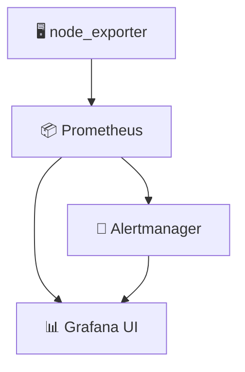

## 📊 Monitoring – Grafana, Prometheus, Alertmanager, Node Exporter

This monitoring stack provides **observability** for your infrastructure and services using:

- **Grafana** – for data visualization
- **Prometheus** – for metrics collection
- **Alertmanager** – for alert dispatching
- **Node Exporter** – for system metrics

---

### 🧱 Architecture Overview



---

### 🔧 Prometheus – Metrics Collector
Prometheus scrapes metrics from the containers/services and stores time-series data.
Configuration is located in:

```swift
srcs/requirements/prometheus/conf/prometheus.yml
```
Key elements:

- Scrapes node_exporter:9100 and localhost:9090

- Alert rules loaded from alert.rules.yml

- Integrated with Alertmanager

Prometheus alert rule example
```yaml
groups:
  - name: temperature_alerts
    rules:
      - alert: HighCPUTemperature
        expr: node_hwmon_temp_celsius > 70
        for: 2m
        labels:
          severity: warning
        annotations:
          summary: "High temperature detected"
          description: "A sensor has detected {{ $value }}°C on {{ $labels.chip }}/{{ $labels.sensor }}"
```
---

### 🚨 Alertmanager – Alert Routing
Alertmanager receives alerts from Prometheus and can route them via:

- Email

- Webhooks

- Other notification services

It is configured to listen on alertmanager:9093.
Example rules for test alerts can also be added.

---

### 📊 Grafana – Dashboards & Visualization
Grafana connects to Prometheus as a data source and automatically loads dashboards from provisioning files.

Provisioning path:

``` swift
srcs/requirements/grafana/provisioning/
├── datasources/
│   └── prometheus.yml
├── dashboards/
│   ├── alertmanager.json
│   ├── 1860_rev37.json
│   └── dashboards.yml
```
These dashboards are loaded automatically at container startup.

Data Source Configuration (prometheus.yml)
``` yaml
apiVersion: 1

datasources:
  - name: Prometheus
    type: prometheus
    access: proxy
    url: http://prometheus:9090
    isDefault: true
    editable: true
```
Dashboard Loader (dashboards.yml)
``` yaml
apiVersion: 1

providers:
  - name: "default"
    orgId: 1
    folder: ""
    type: file
    disableDeletion: false
    editable: true
    options:
      path: /etc/grafana/provisioning/dashboards
```
---
### 🔐 Secrets & Access
Grafana credentials (admin login and password) are fetched from Vault, not hardcoded:
```bash
vault kv get secret/grafana
```
They are rendered at runtime to /vault/grafana/.env.grafana and consumed by Grafana.

---
### 🐳 Docker Integration
All monitoring services are on the monitoring_network Docker network:
``` yaml
networks:
  monitoring_network:
    driver: bridge
```
Expose ports:
| Service        | Port |
|----------------|------|
| Grafana        | 3000 |
| Prometheus     | 9090 |
| Alertmanager   | 9093 |
| Node Exporter  | 9100 |


---
### ✅ Accessing Grafana
Once the project is running:

- Open: https://monitoring.localhost

- Login using credentials defined in: secrets/grafana/.env.grafana

---
### 📌 Summary

| Tool           | Role                          |
|----------------|-------------------------------|
| Grafana        | Visualize metrics & alerts    |
| Prometheus     | Scrapes and stores metrics    |
| Alertmanager   | Routes alerts from Prometheus |
| Node Exporter  | Exposes system-level metrics  |
